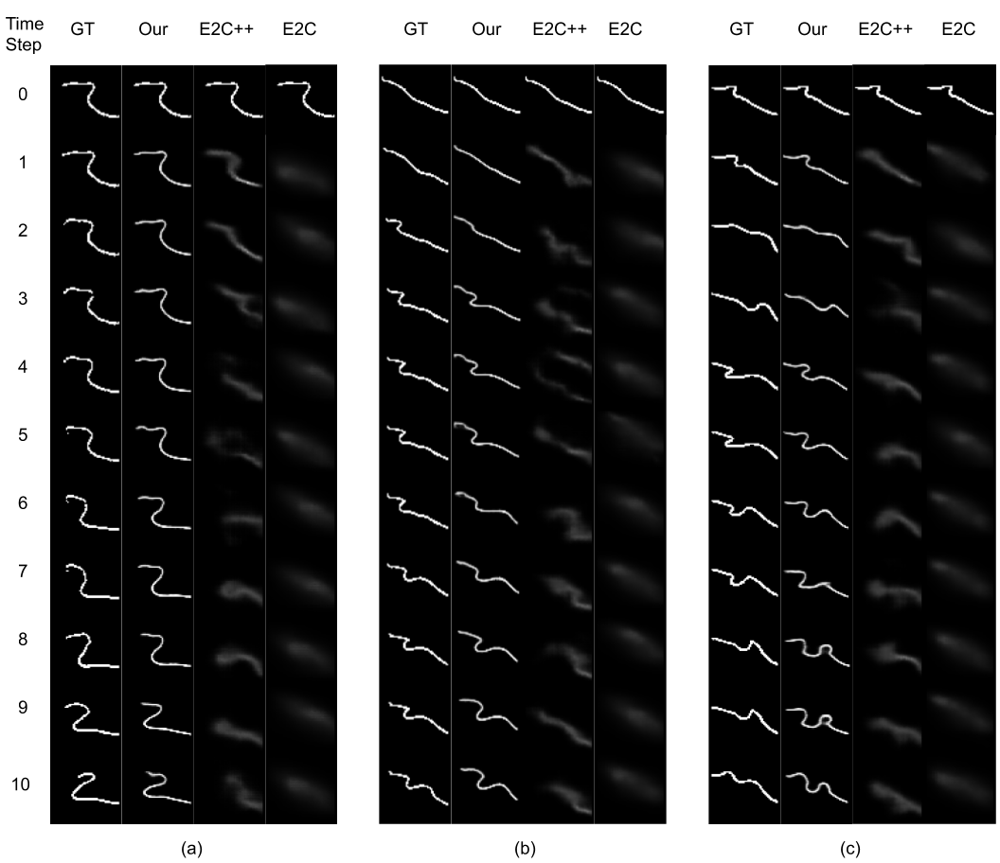
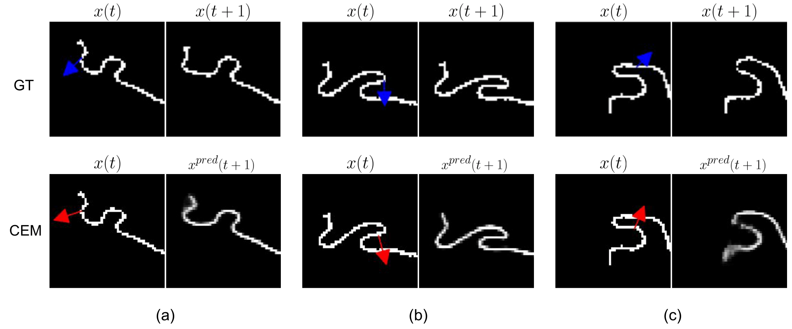

# Deformable Linear Object Prediction Using Locally Linear Latent Dynamics

## Introduction
This repository contains the code for the paper - Deformable Linear Object Prediction Using Locally Linear Latent Dynamics.

Access the [Paper](https://arxiv.org/pdf/2103.14184.pdf) on Arxiv <br /> 
Author: [Wenbo Zhang](https://www.linkedin.com/in/wenbo-zhang6/), [Karl Schmeckpaper](https://sites.google.com/view/karlschmeckpeper), [Pratik Chaudhari](https://pratikac.github.io/), [Kostas Daniilidis](https://www.cis.upenn.edu/~kostas/) <br />
GRASP Laboratory, University of Pennsylvania <br />
The 2021 International Conference on Robotics and Automation (ICRA 2021), Xi'an, China

## Citation
If you use this code for your research, please cite our paper:
```
@article{zhang2021deformable,
  title={Deformable Linear Object Prediction Using Locally Linear Latent Dynamics},
  author={Zhang, Wenbo and Schmeckpeper, Karl and Chaudhari, Pratik and Daniilidis, Kostas},
  journal={IEEE International Conference on Robotics and Automation (ICRA)},
  year={2021}
}
```

## Running the code
### Preparation
Create a folder for the repo
```
mkdir deform
cd deform
```
Build the virtual environment
```
python3 -m pip install --user virtualenv
python3 -m venv deform_env
```

Activate virtual environment
```
source deform_env/bin/activate
```

Install libraries and dependencies
```
pip install torch torchvision
pip install matplotlib
```

Clone the program
```
git clone https://github.com/zwbgood6/deform.git
```

### Dataset
```
mkdir rope_dataset
```
Download the dataset from the [Google Drive](https://drive.google.com/file/d/1jy1EUDSeH3d3cZUSK1xChOBvn-qqx9WA/view?usp=sharing) and place it in the folder `rope_dataset`.

```
cd rope_dataset
unzip paper_dataset.zip
```

### Training
Go to the main deform folder directory
```
python -m deform.model.nn_large_linear_seprt_no_loop_Kp_Lpa
```

### Prediction
After training, run
```
python -m deform.model.pred_nn_large_linear_seprt_np_loop_Kp_Lpa

```
### CEM


## Model Architecture and Hyperparameters


## Experimental Results

Ten-step Prediction



Sampling-based Model Predictive Control



